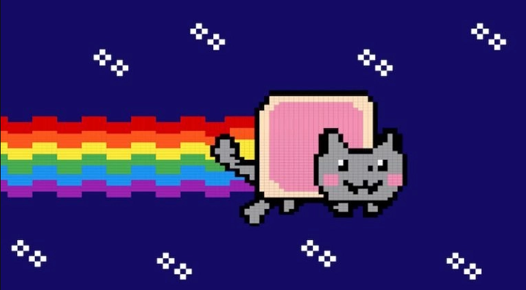

# Informe académico entrega 1
Fecha de entrega: 02-Mayo-2022
Integrantes: Joaquin Bonifacino, Tomas Caetano, Rafael Cadenas

[Link al repositorio]( https://github.com/ORTFIS2022/obligatorio-Bonifacino-Cadenas-Caetano)
## Repositorio Git

Creación y uso de repositorios locales y remotos

Comandos Git ejecutados desde terminal y desde el IDE

## Versionado

Buenas prácticas de versionado

Uso de ramas separadas de 'main'

Resumen de commits y evolución del proyecto

## Elicitación

[Evidencia de actividades de investigación](investigacion/README.md)

[Referencias a fuentes de información](investigacion/README.md)

### Caracterización de usuarios: User Persona
#### José Rondón: 
[link a perfil](investigacion/ImagenesUserPersona/JoseRondon.png)
#### Alfonso Hernández:
[link a perfil](investigacion/ImagenesUserPersona/AlfonsoHernandez.png)
### Carol Cuenca: 
[link a perfil](investigacion/ImagenesUserPersona/CarolCuenca.png)

### Modelo conceptual del problema:
El Marketplace es un sitio donde los productos son ofrecidos por los comerciantes para ser adquiridos por consumidores, es decir, un mercado en el mundo online. En él, varios comerciantes colocan sus productos a la venta en un sólo canal. En este caso el mercado es especializado en *NFT's*, un NFT es un Non-Fungible Token, en otras palabras, que no se puede ni consumir, reemplazar o sustituir. El mismo se basa en ser un certificado digital de autenticidad de compra de un archivo en especifico que se guarda en la cadena de blockchain para su seguridad, por lo tanto es el equivalente a vender obras digitales donde el comprador se queda con el certificado que comprueba que es suyo, por ejemplo: 

 
Este NFT llamado Nyan Cat fue vendido por 600.000 USD, este Nyan Cat NFT esta contenido en la cadena de blockchain de Ethereum.

Una cadena de blockchain es una tecnologia muy popular hoy en dia que consta de bloques (block) que juntos crean una cadena (chain) donde cada bloque guarda internamente un calculo el cual fue creado a partir del bloque anterior en la cadena, eso asegura que si cualquier bloque en la cadena es modificado,movido,agregado o quitado, la propia cadena lo rechaza. Esto ayuda a verificar que este NFT solo existe una vez en toda la blockchain y se crea un token de autenticacion unico para el mismo, el cual es transferido a la persona que lo compra para verificar que es su nuevo dueño. 
## Especificación
### Requerimientos Funcionales
#### Requerimientos de perfil
1. Registro de usuario
2. Login con usuario y contraseña
	1. Chequeo de saldo
	2.  Agregar saldo
	3. Cambio de nombre de Usuario
	4. Cambio de contraseña de Usuario
	5. Mostrar libreria de NFTs
    6. Mostrar lista de favoritos
	7. Logout
    8. Dar de baja usuario
    9. Editar Banner de usuario
#### Requerimientos de mercado
3. Mostrar NFTs
	1. Mostrar listado de NFTs disponibles
	2. Mostrar listado de NFTs por filtro
    3. Mostrar NFT
	4. Comprar NFT
	5. Vender NFT
	6. Dar like a un NFT
    7. Agregar a listas de favoritos del usuario
    8. Buscador de NFTs por nombre

### Requerimientos No Funcionales
#### Interfaz con el Usuario
Se solicita de parte del cliente la utilizacion de el tipo de letra `Roboto`, el uso de tipos de iconos filled,  el nombre de la aplicacion sea *NFTs*, y la paleta de colores del IU sea creada con  `Material.io`
#### Seguridad y Control de Acceso
El sistema mantiene un control de acceso estándar de Login en el cual pide
correo electrónico y contraseña al usuario.
Para mejorar la seguridad de los datos privados de nuestros clientes incorporamos
una encriptación punta a punta de la contraseña bajo el algoritmo `SHA-2 de 512`
bits.

## Casos de uso

### Registro de usuario
1. Usuario hace click en Registrarse.
2. Se despliega el formulario de resgitro de usuario.
3. Usuario ingresa sus datos.
	1. Contraseñas no coinciden en la caja de contraseña y confirmación de contraseña, despliegue de mensaje de error y vuelve a 2.
	2. Nombre no disponible, despliegue de mensaje de error y vuelve a 2.
4. Se despliega mensaje de resgistro exitoso.
5. Se despliega la ventana principal.

### Login usuario y contraseña
1. Usuario hace click en botón Login.
2. Se despliega el formulario de login.
3. Usuario ingresa sus datos de logeo.
	1. Ingreso de Correo no valido, despliegue de mensaje de error y vuelve a 2.
	2. Ingreso de Contraseña incorrecta, despliegue de mensaje de error y vuelve a 2.
4. Despliegue de mensaje de Login completado.
5. Se despliega de ventana principal.

### Chequeo de Saldo
1. Usuario hace click en botón Mi perfil.
2. Se despliega de ventana de Perfil de usuario.
3. Usuario hace click en botón My wallet.
4. Se despliega ventana My wallet con el saldo asociado al usuario.

### Agregar saldo
1. Usuario hace click en botón Mi perfil.
2. Se despliega ventana de Perfil de usuario.
3. Usuario hace click en botón My wallet.
4. Se despliega ventana My wallet con el saldo asociado al usuario.
5. Usuario hace click en botón Agregar saldo.
6. Se despliega el formulario de agregar saldo.
7. Mensaje de ingreso correcto.
8. Despliega ventana de Perfil de usuario.

### Cambio de nombre de usuario
1. Usuario hace click en botón Mi perfil.
2. Se despliega ventana de Perfil de usuario.
3. Usuario hace click en Modificar datos de usuario.
4. Se despliega ventana de Modificar datos de usuario.
5. Usuario hace click en botón de Cambiar nombre
6. Se despliga formulario de Cambio de nombre.
	1. Nombre no disponible, se despliega mensaje de error y vuelve al 4.
7. Se despliega mensaje de cambio de nombre exitoso.
8. Se despliega ventana de Perfil de usuario.

### Cambio de contraseña de usuario
1. Usuario hace click en botón Mi perfil.
2. Se despliega ventana de Perfil de usuario.
3. Usuario hace click en Modificar datos de usuario.
4. Se despliega ventana de Modificar datos de usuario.
5. Usuario hace click en botón de Cambiar contraseña.
6. Se despliega formulario de Cambio de contraseña.
	1. Contraseñas no coinciden en caja de contraseña nueva y confirmación de contraseña nueva, se despliega mensaje de error y vuelve al 4.
7. Se despliega mensaje de cambio de contraseña exitoso.
8. Se despliega ventana de Perfil de usuario.

### Mostrar libreria de NFTs
1. Usuario hace click en botón Mi perfil.
2. Se despliega ventana de Perfil de usuario.
3. Se muestra las NFTs adquiridas.

### Mostrar lista de favoritos
1. Usuario hace click en botón Mi perfil.
2. Se despliega ventana de Perfil de usuario.
3. Usuario hace click en botón Mis favoritos.
4. Se despliega ventana de Favoritos y se muestran los NFTs marcados como favoritos.

### Logout
1. Usuario hace click en botón Mi perfil.
2. Se despliega ventana de Perfil de usuario.
3. Usuario hace click en botón Cerrar sesión.
4. Se despliega ventana principal.

### Dar de baja usuario
1. Usuario hace click en botón Mi perfil.
2. Se despliega ventana de Perfil de usuario.
3. Usuario hace click en Modificar datos de usuario.
4. Se despliega ventana de Modificar datos de usuario.
5. Usuario hace click en botón Cerrar cuenta.
6. Se despliega mensaje de confirmación.
	1. Usuario hace click en botón cancelar.
		1. Se despliega ventana de Modificar datos de usuarios.
	2. Usuario hace click en botón aceptar.
		1. Se despliega ventana principal.

### Editar Banner de usuario
1. Usuario hace click en botón Mi perfil.
2. Se despliega ventana de Perfil de usuario.
3. Usuario hace click en Modificar datos de usuario.
4. Se despliega ventana de Modificar datos de usuario.
5. Usuario hace click en botón de Cambiar banner.
6. Se despliega el seleccionador de archivos de windows de Cambio de banner.
7. Se despliega mensaje de cambio de banner exitoso.
8. Se despliega ventana de Perfil de usuario.

### Mostrar listado NFTs
1. Se valida si hay un filtro activo o no.
2. Se muestra el listado ordenado según el filtro.

### Mostrar NFT
1. Usuario hace click en la NFT deseada.
2. Se despliega la ventana con los datos de la NFT.

### Comprar NFT
1. Usuario hace click en la NFT deseada.
2. Se despliega la ventana con los datos de la NFT.
3. Usuario hace click en botón Comprar.
	1. Saldo del usuario insuficiente para realizar la transacción, despliegue de mensaje de error y vuelve a 2.
	2. Se despliega mensaje de compra exitosa.

### Vender NFT
1. Usuario hace click en botón Mi perfil.
2. Se despliega ventana de Perfil de usuario.
3. Usuario hace click en botón Vender NFT.
4. Se despliega formulario para la alta de la venta.
5. Se despliega mensaje de ingreso exitoso.

### Dar like a un NFT
1. Usuario hace click en botón con forma de corazón en el NFT deseado.
2. Aumenta el contador de likes.

### Agregar a listas de favoritos del usuario
1. Usuario hace click en botón con forma de estrella en el NFT deseado.
2. Se agrega NFT a la lista de favoritos.

### Buscador de NFTs por nombre
1. Usuario hace click en el buscador.
2. Usuario ingresa el nombre.
3. Se despliega el listado de NFTs que coinciden con el nombre.

## Bocetos de IU
[Imagenes de bocetos de IU](./bocetosiu/)

Se utiliza la aplicacion [Marvel App](https://marvelapp.com/) para el boceto de las diferentes paginas de la UI.

[Prototipo tentativo creado con Marvel App](https://marvelapp.com/prototype/ddd5iei/screen/86384836)

## Validación y verificación

Verificar la especificación

Validar la solución con personas no involucradas en el proyecto:
Validaciones hechas con el prototipado a: Mauricio Bonifacino y Carlos Caetano

## Reflexión

### Detalle del trabajo individual:

Bonifacino: Mitad de los bocetos de IU, Investigacion y referencias a fuentes con imagenes y prototipado.

Cadenas: Diseño de 2 user persona, Casos de uso

Caetano: 
Diseño de la mitad de los bocetos de IU,1 User Persona
Busqueda de gifs para utilizar como NFTs
Creacion, copia, administracion de permisos y knowledge transfer de respositorio de Git

Todos juntos: Requerimientos funcionales y no funcionales, modelo conceptual del problema

Técnicas aplicadas:
Casos de uso, Bocetos de interfaces de Usuario, User Persona, Prototipacion

### Aprendizajes:
Aprendimos a tener un manejo basico de versionado y utilizacion de ramas para `Github` lo cual vimos increiblemente util incluso en repetidos casos donde cometiamos un error y teniamos el historial de commits para hacer un rollback.

Tambien aprendimos a utilizar la herramienta de bocetos `UX Marvel App` la cual tambien nos permitio la aplicación de la tecnica de prototipado para crear un prototipo tentativo el cual fue mostrado a personas fuera del proyecto para la validacion adecuada de las funciones del mismo.

Asimismo, utilizamos `XTensio` para la creacion y formateo de User Persona, trae plantillas predeterminadas para varios usos y fue muy util ya que tiene ciertas features como las barras de nivel para medir determinados atributos de la persona. Nos gusto que es bastante customizable y la version de prueba gratis tiene pocas limitaciones.

Ademas, utilizamos `VisualCode` para la edición de los archivos, nos resulto bastante cómodo ya que `VisualCode` tiene una función de preview de markdown integrada que se activa con *CTRL + K V*, como referencia para aprender el lenguaje markdown usamos [MEditor.md](https://pandao.github.io/editor.md/en.html) con su texto de ejemplo.

Mas alla de que tuvimos varias reuniones presenciales, para ser mas eficientes y no perder tiempo en el transporte (ya que uno de nuestros integrantes vive a mas de 1 hora del resto) decidimos hacer la mitad de las reuniones online a travez de `Discord` y la mitad presenciales.

Para la creación de la paleta de colores para los bocetos UX utilizamos [Adobe Color Explorer](https://color.adobe.com/es/explore) para la definición original de los colores, y luego [Material IO](https://material.io/design) para la ligera modificacion de la paleta para mejorar la legibilidad del texto y contraste.

