# Carpeta para evidencia de investigación

## Imagenes de investigacion

### Imagenes de Binance
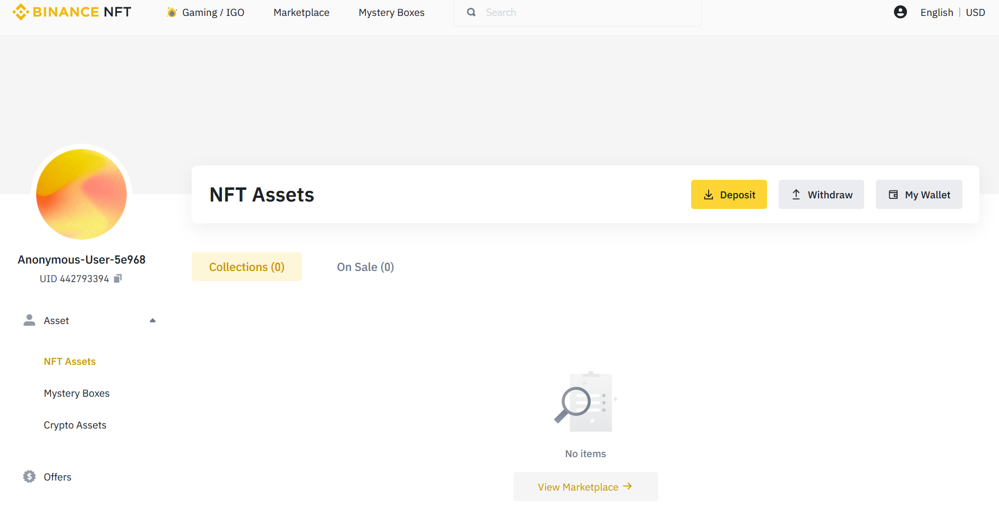
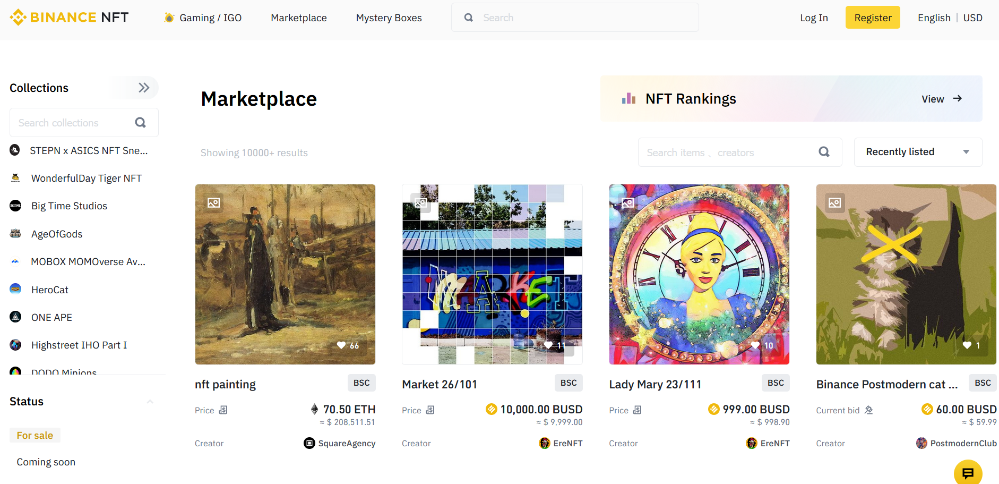
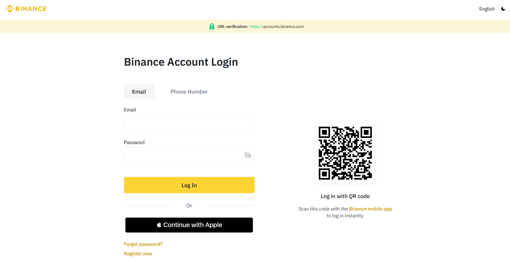
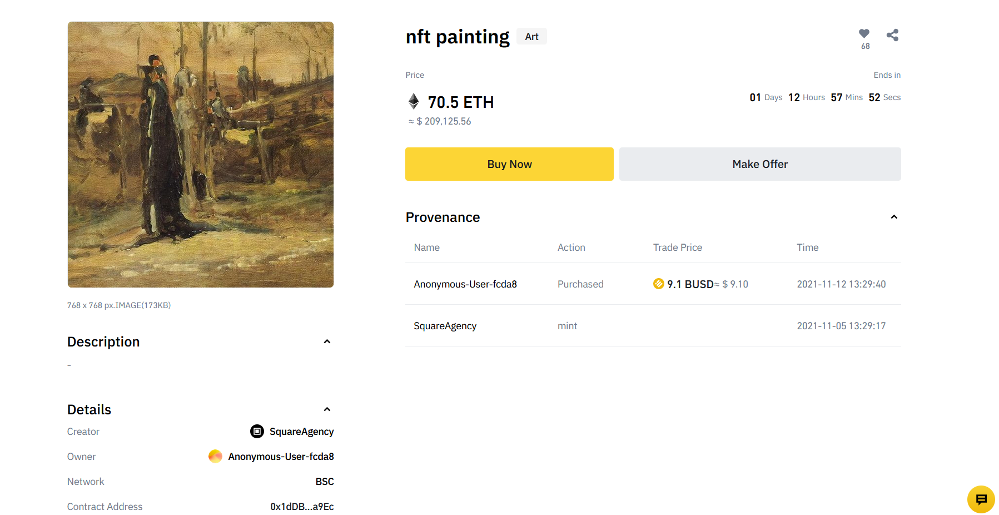

### Imagenes de OpenSea

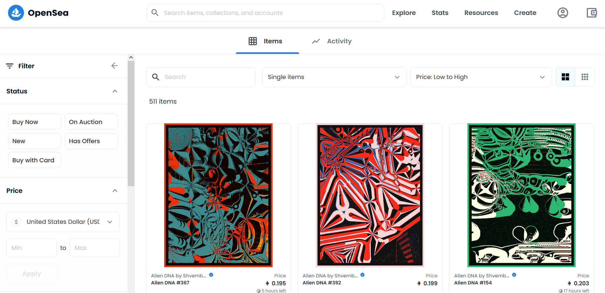
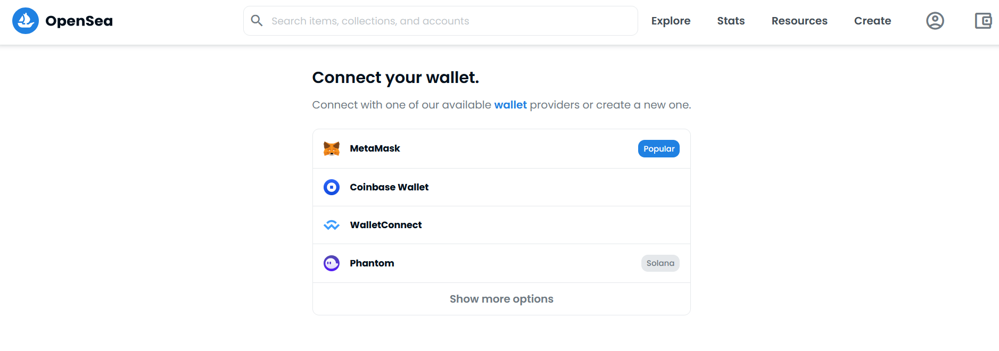
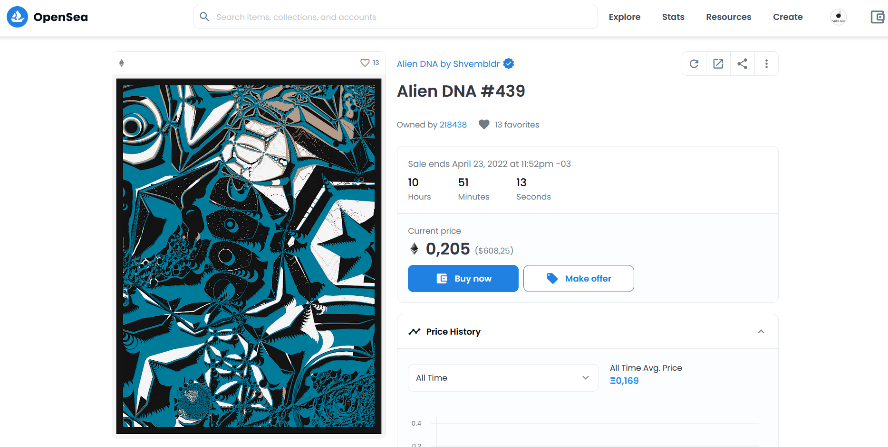

### Imagenes de Crypto.com
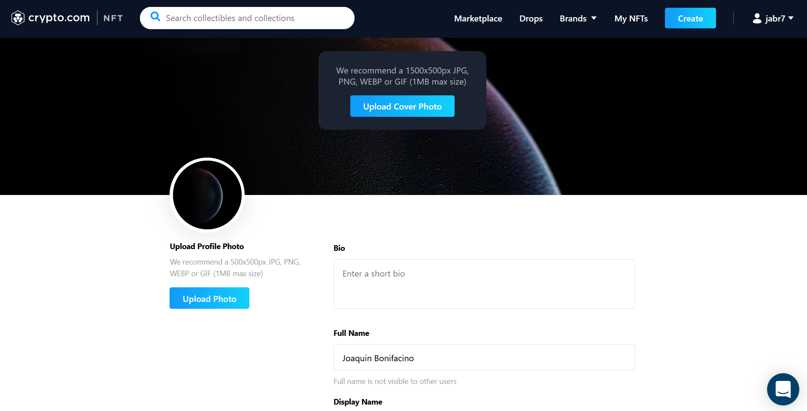
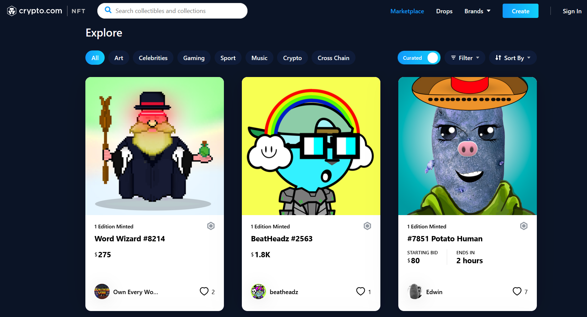
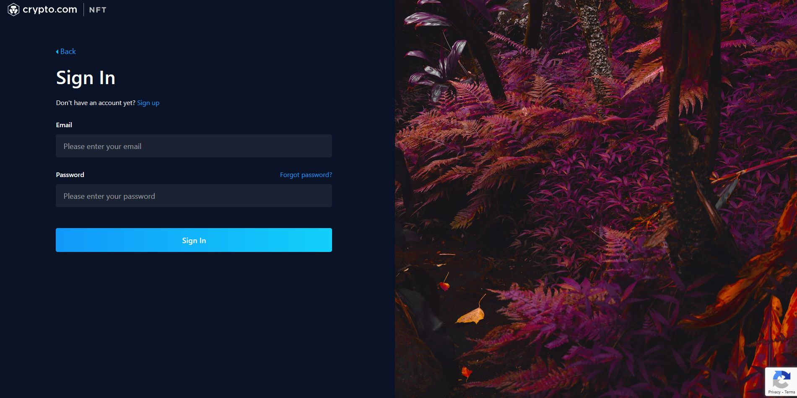
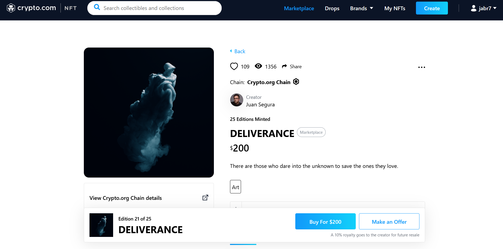

## Link de investigacion
https://www.binance.com/en/nft/game-offering  
https://opensea.io/collection/alien-dna-by-shvembldr  
https://crypto.com/nft/login  
