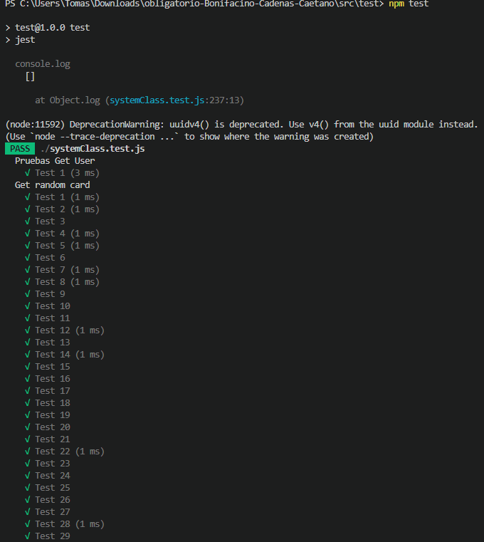
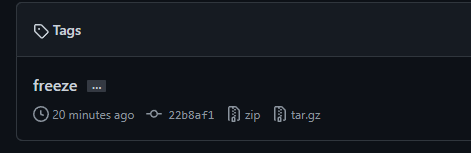
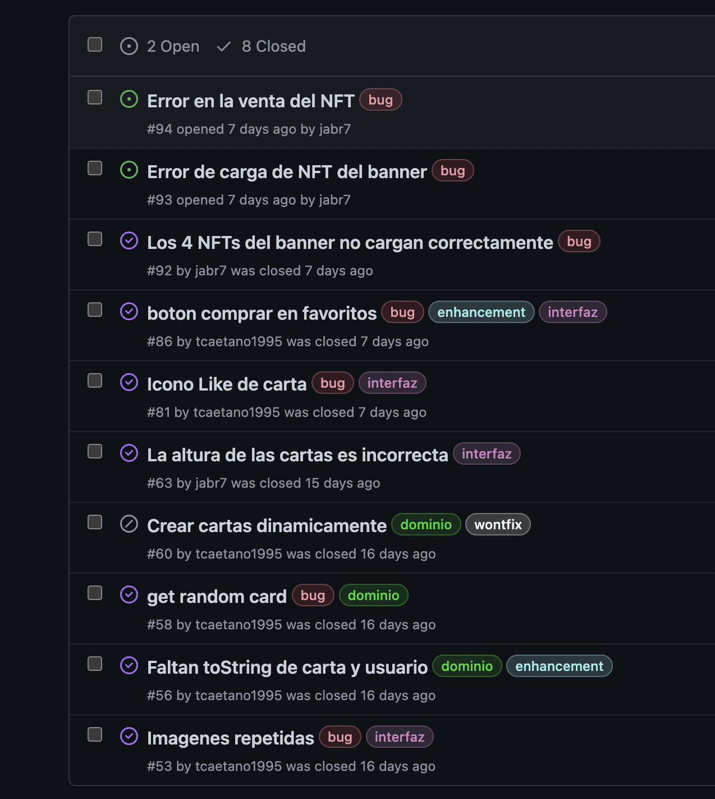
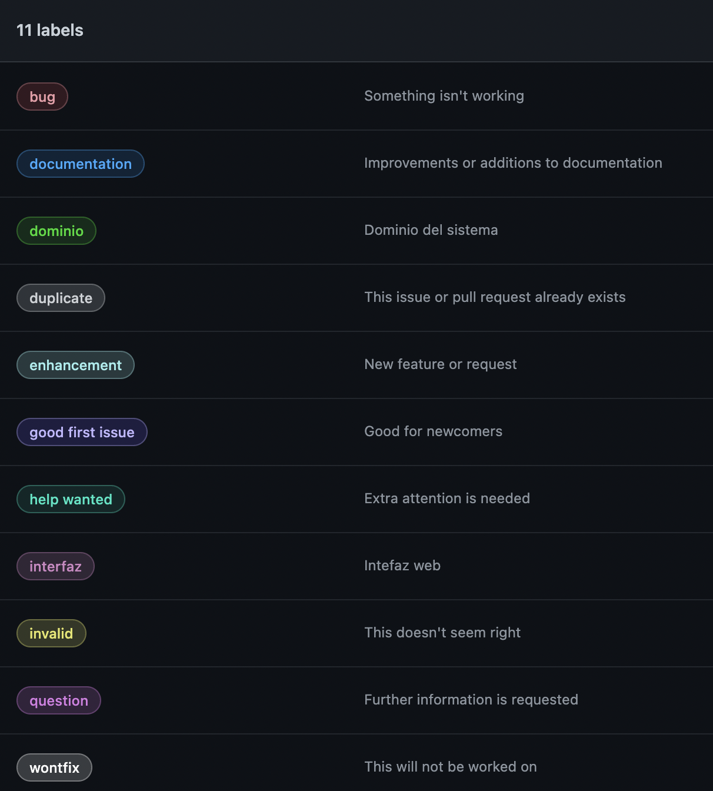
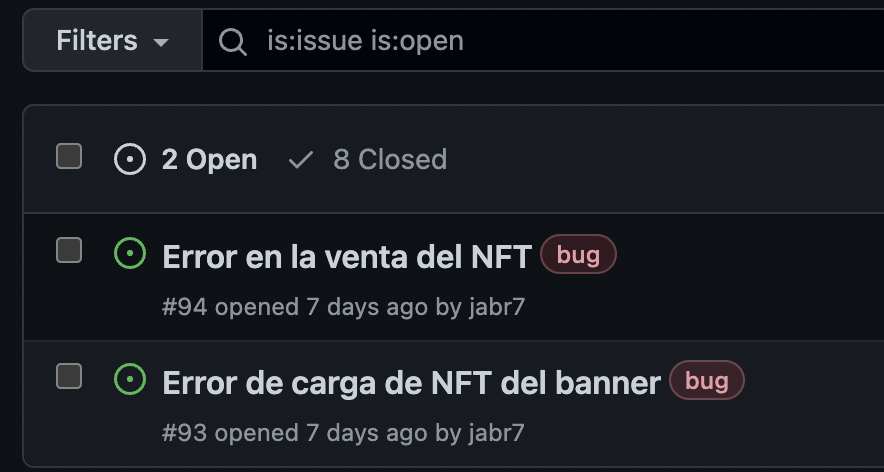

# Informe académico entrega 2
Fecha de entrega: 29-nov-2021

## Construcción

Implementación de funciones principales (sin la necesidad de persistencia de datos):

Algunas de las características o incluso algunas funcionalidades se vieron fuera del alcance o innecesarias para el proyecto, lo omitido es lo siguiente:

### Funciones de perfil:
1. Dar de baja un usuario.
2. Editar banner (Directamente el usuario no tiene banner).

### Requerimientos de mercado
1. Mostrar NFT (Se omitio el mostrar informacion del NFT, ya que toda la información del NFT se puede ver desde la lista de NFTs, así como el comprar o vender).

### Requerimientos no funcionales
1. Seguridad y control de acceso (Omitida por ser innecesaria en este proyecto)

En algunos casos de uso se modifico el walktrough por comodidad, y son las siguientes:

### Agregar saldo
1. Cambian los pasos 5, 6 y 8, quedando 5 "Se despliega el formulario", 6 "Usuario hace click en ingresar monto" y el 8 "reset del formulario".

### Cambiar nombre y Cambiar contraseña
1. Se unieron ambos en un solo caso.
2. Se omite el paso 3 "Hacer click en modificar", al hacer click en Información ya despliega el formulario de actualización de datos.
3. No se realiza el paso 6 de Contraseña "Confirmación de contraseña"

### Comprar NFT
1. Solo se realiza el paso 3 con los casos alternativos alegados.

### Vender NFT
1. Se omite el paso 3 y 4.
2. Las ventas se realizan directamente en la libreria de NFTs comprados.

### Logout
1. Cambia solo el paso 4, que es "Se despliega formulario de login"

## Configuración de plataforma tecnológica para desarrollo y producción:

Se utilizó un servidor de NodeJS con webpack 3 instalado, dependencias de material design y esLint a través de comandos npm install.

## Documentación del uso de librerías externas (package.json)
### Dominio
|  Nombre |Version   |Razon   |
| ------------ | ------------ | ------------ |
| process | 0.11.10   | Requerido por webpack
| util| 0.12.4 |Requerido por webpack
|uuidv4| 6.2.13 | Utilizado para identificar cartas
|eslint| 8.17.0| Buenas practicas
|eslint-config-google| 0.14.0| Reglas de estandar de google

### Interfaz
|  Nombre |Version   |Razon   |
| ------------ | ------------ | ------------ |
| material/snackbar | 12.0.0  | Requerido por material
| material-components-web| 11.0.0 |Elementos graficos para interfaz 
|eslint | 8.17.0 | Buenas practicas de programacion
|eslint-config-google| 0.14.0| Reglas de estandar de google
"@babel/core"| "^7.13.16"| Utilizado por Webpack
"@babel/preset-env"| "^7.13.15"| Utilizado por Webpack
"autoprefixer"| "^10.2.5"| Utilizado por Webpack
"babel-loader"| "^8.2.2"| Utilizado por Webpack
"css-loader"| "^5.2.4"| Utilizado por Webpack
"extract-loader"| "^5.1.0"| Utilizado por Webpack
"file-loader"| "^6.2.0"| Utilizado por Webpack
"postcss-loader"| "^5.2.0"| Utilizado por Webpack
"sass"| "^1.32.11"| Utilizado por Webpack
"sass-loader"| "^11.0.1"| Utilizado por Webpack
"webpack"| "^5.36.0"| Server Packaging
"webpack-cli"| "^4.6.0"| Utilizado por Webpack
"webpack-dev-server"| "^3.11.2"| Utilizado por Webpack
       

## Interfaz de usuario

### Interfaz de usuario web / mobile (responsive)
Todas las interfaces fueron hechas de forma responsive para dispositivos de 600px de ancho hacia arriba, ejemplos:
Ejemplo 1 Login:


Ejemplo 2 Marketplace:


GIF para mostrar la propiedad responsive del sistema:


### Página única con navegación entre secciones
Demostracion de como toda la pagina esta escrita en un solo html, css y js:


### Implementación: Material Design Web Components
Como uno de los muchos ejemplos de la utilizacion de material:
Lo marcado en rojo son objetos utilizados de material, como puede ser `Material ImageList` para toda la lista de NFT y luego `Material Cards` para la representacion de NFTs dentro de la lista, lo demas son `Material Buttons` como bottones, `Material Text Field` para los inputs de texto, `Material App Bar` para la top bar para mantener el logo, boton de marketplace y el icono de perfil siempre en el mismo lugar, este ultimo fue creado con `Material Icons`, finalmente utilizamos `Material Tabs` para las diferentes ventanas dentro de la ventana de perfil.


Aplicar un sistema de diseño y principios de usabilidad

### Cumplimiento de estándar de accesibilidad WCAG
cumpliendo con los estandares de accesibilidad minimos, todas las imagenes tienen su texto alternativo (incluyendo las imagenes de los NFTs con sus nombres) y el texto de toda la pagina se adapta a su tamaño.

### Seguir especificación de estilo
Utilizamos el plugin eslint a partir de la especificacion de estilo de google para toda la interfaz y el dominio

## Codificación
Se utilizo el IDE Visual studio code para la codificacion de la pagina web.

Se aplicaron los estandares de codificacion de google para javascript

Se utilizaron buenas practicas de OOP separando la logica (dominio) de la interfaz


## Test unitario

Test unitarios con Jest en la clase sistema exitosos, por ende es implícito que el testing en las clases utilizadas en sistema es satisfactorio.

100% cobertura en clases de dominio



## Code freeze

Se realizo un code freeze previo a la presentacion en clase.

El mismo puede ser chequeado en un tag del repositorio "freeze", el mismo puede ser utilizado como punto de prueba para la correccion del mismo (```git checkout freeze```).




## Test de sistema

### Test exploratorios
| Localizacion            | Requisitos previos                                                                           | Caso                                      | Accion                                                                                                             | Resultado Esperado                                                                                                                                                                     | Resultado Obtenido                                                                                                                                                                               | Observaciones                                                                                                                                                               | Resultado Correcto |
| ----------------------- | -------------------------------------------------------------------------------------------- | ----------------------------------------- | ------------------------------------------------------------------------------------------------------------------ | -------------------------------------------------------------------------------------------------------------------------------------------------------------------------------------- | ------------------------------------------------------------------------------------------------------------------------------------------------------------------------------------------------ | --------------------------------------------------------------------------------------------------------------------------------------------------------------------------- | ------------------ |
| Login                   | No logeado                                                                                   | Abrir marketplace                         | Dale click al boton "Marketplace"                                                                                  | Mensaje: "Debe logearse con usuario y contraseña"                                                                                                                                      | Mensaje: "Debe logearse con usuario y contraseña"                                                                                                                                                |                                                                                                                                                                             | ✅                  |
| Login                   | No logeado                                                                                   | Abrir perfil                              | Dale click al icono de perfil en la esquina<br>superior derecha con el simbolo de una<br>persona                   | Mensaje: "Debe logearse con usuario y contraseña"                                                                                                                                      | Mensaje: "Debe logearse con usuario y contraseña"                                                                                                                                                |                                                                                                                                                                             | ✅                  |
| Registro                | No logeado                                                                                   | Abrir marketplace                         | Dale click al boton "Marketplace"                                                                                  | Mensaje: "Debe logearse con usuario y contraseña"                                                                                                                                      | Mensaje: "Debe logearse con usuario y contraseña"                                                                                                                                                |                                                                                                                                                                             | ✅                  |
| Registro                | No logeado                                                                                   | Abrir perfil                              | Dale click al icono de perfil en la esquina<br>superior derecha con el simbolo de una<br>persona                   | Mensaje: "Debe logearse con usuario y contraseña"                                                                                                                                      | Mensaje: "Debe logearse con usuario y contraseña"                                                                                                                                                |                                                                                                                                                                             | ✅                  |
| Olvide mi<br>Contraseña | No logeado                                                                                   | Abrir marketplace                         | Dale click al boton "Marketplace"                                                                                  | Mensaje: "Debe logearse con usuario y contraseña"                                                                                                                                      | Mensaje: "Debe logearse con usuario y contraseña"                                                                                                                                                |                                                                                                                                                                             | ✅                  |
| Olvide mi<br>Contraseña | No logeado                                                                                   | Abrir perfil                              | Dale click al icono de perfil en la esquina<br>superior derecha con el simbolo de una<br>persona                   | Mensaje: "Debe logearse con usuario y contraseña"                                                                                                                                      | Mensaje: "Debe logearse con usuario y contraseña"                                                                                                                                                |                                                                                                                                                                             | ✅                  |
| Login                   | Usuario y contraseña existentes y correctos                                                  | <br>Logeo                                 | Dale click al boton "Login"                                                                                        | Logeado en el sistema<br>y apertura de Marketplace                                                                                                                                     | Logeado en el sistema<br>y apertura de Marketplace                                                                                                                                               |                                                                                                                                                                             | ✅                  |
| Login                   | Usuario correcto e existente, contraseña incorrecta                                          | <br>Logeo                                 | Dale click al boton "Login"                                                                                        | Mensaje: "Error el usuario o contraseña<br>están incorrectos, o el usuario no existe" y limpia campos                                                                                  | Mensaje: "Error el usuario o contraseña<br>están incorrectos, o el usuario no existe" y limpia campos                                                                                            |                                                                                                                                                                             | ✅                  |
| Login                   | Usuario incorrecto, contraseña existente                                                     | <br>Logeo                                 | Dale click al botón "Login"                                                                                        | Mensaje: "Error el usuario o contraseña<br>están incorrectos, o el usuario no existe" y limpia campos                                                                                  | Mensaje: "Error el usuario o contraseña<br>están incorrectos, o el usuario no existe" y limpia campos                                                                                            |                                                                                                                                                                             | ✅                  |
| Login                   | Usuario incorrecto, contraseña no existente                                                  | <br>Logeo                                 | Dale click al botón "Login"                                                                                        | Mensaje: "Error el usuario o contraseña<br>están incorrectos, o el usuario no existe" y limpia campos                                                                                  | Mensaje: "Error el usuario o contraseña<br>están incorrectos, o el usuario no existe" y limpia campos                                                                                            |                                                                                                                                                                             | ✅                  |
| Login                   | Usuario vacío, contraseña correcta                                                           | <br>Logeo                                 | Dale click al botón "Login"                                                                                        | Mensaje: "Error el usuario o contraseña<br>están incorrectos, o el usuario no existe" y limpia campos                                                                                  | Mensaje: "Error el usuario o contraseña<br>están incorrectos, o el usuario no existe" y limpia campos                                                                                            |                                                                                                                                                                             | ✅                  |
| Login                   | Usuario correcto, contraseña vacía                                                           | <br>Logeo                                 | Dale click al botón "Login"                                                                                        | Mensaje: "Error el usuario o contraseña<br>están incorrectos, o el usuario no existe" y limpia campos                                                                                  | Mensaje: "Error el usuario o contraseña<br>están incorrectos, o el usuario no existe" y limpia campos                                                                                            |                                                                                                                                                                             | ✅                  |
| Login                   | Usuario vacío, contraseña vacía                                                              | <br>Logeo                                 | Dale click al botón "Login"                                                                                        | Mensaje: "Error el usuario o contraseña<br>están incorrectos, o el usuario no existe" y limpia campos                                                                                  | Mensaje: "Error el usuario o contraseña<br>están incorrectos, o el usuario no existe" y limpia campos                                                                                            |                                                                                                                                                                             | ✅                  |
| Registro                | Usuario existente, contraseña correcta,<br>verificación contraseña igual a contraseña        | Registro                                  | Dale click al botón "Registrarse"                                                                                  | Mensaje: "El usuario ya existe"                                                                                                                                                        | Mensaje: "Usuario agregado exitosamente"<br>Se crea y agrega el usuario                                                                                                                          | Faltó chequear en el registro<br>si el usuario ya existia en el sistema                                                                                                     | ❌                  |
| Registro                | Usuario no existente, contraseña correcta,<br>verificación contraseña igual a contraseña     | Registro                                  | Dale click al botón "Registrarse"                                                                                  | Mensaje: "Usuario agregado exitosamente", vuelve al<br>login solo y limpia los campos                                                                                                  | Mensaje: "Usuario agregado exitosamente" y vuelve al<br>login solo                                                                                                                               | Falto limpiar los campos de registro                                                                                                                                        | ❌                  |
| Registro                | Usuario no existente, contraseña correcta,<br>verificación contraseña diferente a contraseña | Registro                                  | Dale click al botón "Registrarse"                                                                                  | Mensaje: "La contraseña ingresada no coincide"                                                                                                                                         | Mensaje: "La contraseña ingresada no coincide"                                                                                                                                                   |                                                                                                                                                                             | ✅                  |
| Registro                | Usuario no existente, contraseña correcta,<br>verificacion contraseña vacia                  | Registro                                  | Dale click al botón "Registrarse"                                                                                  | Mensaje: "La contraseña ingresada no coincide"                                                                                                                                         | Mensaje: "La contraseña ingresada no coincide"                                                                                                                                                   |                                                                                                                                                                             | ✅                  |
| Registro                | Usuario no existente, contraseña vacia,<br>verificacion contraseña correcta                  | Registro                                  | Dale click al botón "Registrarse"                                                                                  | Mensaje: "La contraseña ingresada no coincide"                                                                                                                                         | Mensaje: "La contraseña ingresada no coincide"                                                                                                                                                   |                                                                                                                                                                             | ✅                  |
| Registro                | Usuario no existente, contraseña vacia,<br>verificacion contraseña vacia                     | Registro                                  | Dale click al botón "Registrarse"                                                                                  | Mensaje: "La contraseña ingresada no coincide"                                                                                                                                         | Mensaje: "Usuario agregado exitosamente" y vuelve al<br>login solo                                                                                                                               | No verificamos que la contraseña sea<br>vacia pero no te deja logearte con ese usuario                                                                                      | ❌                  |
| Registro                | Usuario existente, contraseña vacia,<br>verificacion contraseña vacia                        | Registro                                  | Dale click al botón "Registrarse"                                                                                  | Mensaje: "La contraseña ingresada no coincide"                                                                                                                                         | Mensaje: "Usuario agregado exitosamente" y vuelve al<br>login solo                                                                                                                               | Por alguna razon si intentamos registrar<br>un usuario que ya existe y dejamos los<br>campos de contraseña vacios, crea el usuario<br>y luego te deja logearte con el mismo | ❌                  |
| Registro                | \-                                                                                           | Volver de Registro a login                | Dale click a la flecha superior izquierda                                                                          | Vuelve al login                                                                                                                                                                        | Vuelve al login                                                                                                                                                                                  |                                                                                                                                                                             | ✅                  |
| Olvide mi<br>Contraseña | Usuario no existente, Nueva contraseña correcta,<br>Verificar contraseña correcta            | Restaurar contraseña                      | Dale click al botón "Actualizar"                                                                                   | Mensaje: "Ese usuario no existe"                                                                                                                                                       | Mensaje: "Ese usuario no existe"                                                                                                                                                                 |                                                                                                                                                                             | ✅                  |
| Olvide mi<br>Contraseña | Usuario no existente, Nueva contraseña vacia,<br>Verificar contraseña correcta               | Restaurar contraseña                      | Dale click al botón "Actualizar"                                                                                   | Mensaje: "La contraseña ingresada no coincide"                                                                                                                                         | Mensaje: "La contraseña ingresada no coincide"                                                                                                                                                   |                                                                                                                                                                             | ✅                  |
| Olvide mi<br>Contraseña | Usuario no existente, Nueva contraseña correcta,<br>Verificar contraseña vacia               | Restaurar contraseña                      | Dale click al botón "Actualizar"                                                                                   | Mensaje: "La contraseña ingresada no coincide"                                                                                                                                         | Mensaje: "La contraseña ingresada no coincide"                                                                                                                                                   |                                                                                                                                                                             | ✅                  |
| Olvide mi<br>Contraseña | Usuario existente, contraseña correcta,<br>Verificar contraseña vacia                        | Restaurar contraseña                      | Dale click al botón "Actualizar"                                                                                   | Mensaje: "La contraseña ingresada no coincide"                                                                                                                                         | Mensaje: "La contraseña ingresada no coincide"                                                                                                                                                   |                                                                                                                                                                             | ✅                  |
| Olvide mi<br>Contraseña | Usuario existente, contraseña vacia,<br>Verificar contraseña correcta                        | Restaurar contraseña                      | Dale click al botón "Actualizar"                                                                                   | Mensaje: "La contraseña ingresada no coincide"                                                                                                                                         | Mensaje: "La contraseña ingresada no coincide"                                                                                                                                                   |                                                                                                                                                                             | ✅                  |
| Olvide mi<br>Contraseña | Usuario existente, contraseña correcta,<br>Verificar contraseña no coincide con contraseña   | Restaurar contraseña                      | Dale click al botón "Actualizar"                                                                                   | Mensaje: "La contraseña ingresada no coincide"                                                                                                                                         | Mensaje: "La contraseña ingresada no coincide"                                                                                                                                                   |                                                                                                                                                                             | ✅                  |
| Olvide mi<br>Contraseña | Usuario no existente, contraseña correcta,<br>Verificar contraseña coincide con contraseña   | Restaurar contraseña                      | Dale click al botón "Actualizar"                                                                                   | Mensaje: "La contraseña ingresada no coincide"                                                                                                                                         | Mensaje: "La contraseña ingresada no coincide"                                                                                                                                                   |                                                                                                                                                                             | ✅                  |
| Olvide mi<br>Contraseña | Usuario existente, contraseña correcta,<br>Verificar contraseña coincide con contraseña      | Restaurar contraseña                      | Dale click al botón "Actualizar"                                                                                   | Mensaje: "Contraseña actualizada exitosamente"                                                                                                                                         | Mensaje: "Contraseña actualizada exitosamente"                                                                                                                                                   |                                                                                                                                                                             | ✅                  |
| Olvide mi<br>Contraseña | \-                                                                                           | Volver de restaurar contraseña<br>a login | Dale click a la flecha superior izquierda                                                                          | Volver al Login                                                                                                                                                                        | No hace nada                                                                                                                                                                                     | Nos olvidamos de programar la vuelta al<br>login desde esta pantalla                                                                                                        | ❌                  |
| Marketplace             | Usuario dispone del monto necesario para una compra                                          | Compra de un NFT                          | \- Dale click en BUY                                                                                               | Se compra NFT, se descuenta del monto el precio, se elimina el<br>NFT del marketplace y se agrega a la librería del Usuario                                                            | Se compró el NFT, se descontó del monto el precio del NFT,<br>se eliminó el NFT del marketplace y se agregó a la librería                                                                        |                                                                                                                                                                             | ✅                  |
| Marketplace             | \-                                                                                           | Buscar NFT                                | \- Escribe el nombre o parte del nombre                                                                            | Se despliega la lista de NFTs que coinciden con el texto                                                                                                                               | Se desplegó la lista de NFTs que coinciden o contienen el texto                                                                                                                                  |                                                                                                                                                                             | ✅                  |
| Marketplace             | \-                                                                                           | Filtrar por precio<br>Mayor-menor         | \- Dale click en elija un filtro<br>\- Dale click en precio alto bajo                                              | Se despliega la lista de NFTs cumpliendo con el filtro                                                                                                                                 | Se desplegó la lista de NFTs según el flitro seleccionado                                                                                                                                        |                                                                                                                                                                             | ✅                  |
| Marketplace             | \-                                                                                           | Filtrar por precio<br>Menor-mayor         | \- Dale click en elija un filtro<br>\- Dale click en precio bajo alto                                              | Se despliega la lista de NFTs cumpliendo con el filtro                                                                                                                                 | Se desplegó la lista de NFTs según el flitro seleccionado                                                                                                                                        |                                                                                                                                                                             | ✅                  |
| Marketplace             | \-                                                                                           | Filtrar por fecha                         | \- Dale click en elija un filtro<br>\- Dale click en fecha                                                         | Se despliega la lista de NFTs cumpliendo con el filtro                                                                                                                                 | Se desplegó la lista de NFTs según el flitro seleccionado                                                                                                                                        |                                                                                                                                                                             | ✅                  |
| Marketplace             | \-                                                                                           | Filtrar por mas gustados                  | \- Dale click en elija un filtro<br>\- Dale click en lo mas gustados                                               | Se despliega la lista de NFTs cumpliendo con el filtro                                                                                                                                 | Se desplegó la lista de NFTs según el flitro seleccionado                                                                                                                                        |                                                                                                                                                                             | ✅                  |
| Perfil                  | NFT Comprado                                                                                 | Vender un NFT                             | \- Dale click en SELL                                                                                              | \- Cartel indicando venta exitosa<br>\- Elimina el NFT de la librería<br>\- Aumenta Saldo correctamente<br>\-Se agrega el NFT al marketplace                                           | Se notificó de la venta exitosa, se eliminó de la librería,<br>se agregó el monto a partir del precio del NFT y<br>se agregó el NFT al marketplace                                               |                                                                                                                                                                             | ✅                  |
| Perfil                  | NFT Comprado<br>Haber aplicado un filtro en Marketplace                                      | Vender un NFT                             | \- Dale click en SELL                                                                                              | \- Cartel indicando venta exitosa<br>\- Elimina el NFT de la librería<br>\- Aumenta Saldo correctamente<br>\-Se agrega el NFT al marketplace en el lugar correspondiente<br>al filltro | Se notificó de la venta exitosa, se eliminó de la librería,<br>se agregó el monto a partir del precio del NFT y<br>se agregó el NFT al marketplace<br>pero no al lugar correspondiente al filtro | No se resetea el select de filtro                                                                                                                                           | ❌                  |
| Perfil                  | Agregar un NFT a favoritos                                                                   | Verificar favoritos                       | \- Dale click en pestaña Favoritos                                                                                 | \- Aparece el NFT en favoritos<br>                                                                                                                                                     | Se notifica y aparece en favoritos                                                                                                                                                               |                                                                                                                                                                             | ✅                  |
| Perfil                  | \-                                                                                           | Agregar saldo                             | \- Dale click en pestaña Wallet<br>\- Inserta un número en el campo<br>\- Dale click en Agregar                    | \- Se notifica el cambio<br>\- Saldo aumentado correctamente                                                                                                                           | Aparece el mensaje de saldo Agregado y actualiza el monto                                                                                                                                        |                                                                                                                                                                             | ✅                  |
| Perfil                  | \-                                                                                           | Agregar saldo                             | \- Dale click en pestaña Wallet<br>\- Inserta una letra en el campo<br>\- Dale click en Agregar                    | \- Se notifica el error<br>\- Saldo no aumenta                                                                                                                                         | Aparece el mensaje de error y el saldo se mantiene                                                                                                                                               |                                                                                                                                                                             | ✅                  |
| Perfil                  | Tener un NFT en favoritos                                                                    | Quitar de favoritos                       | \- Dale click en el corazón de la carta                                                                            | \-Se notifica la eliminación de favoritos<br>\- Desaparece el NFT de favorito                                                                                                          | Se notifica de la eliminación y se elimina el NFT de favoritos                                                                                                                                   |                                                                                                                                                                             | ✅                  |
| Perfil                  | \-                                                                                           | Cambiar contraseña                        | \- Ingresa una contraseña a cambiar<br>\- Dale click en Actualizar                                                 | \- Se notifica el cambio de contraseña                                                                                                                                                 | Aparece 1 mensaje que indica que el username es el mismo de antes y<br>1 mensaje indicando el cambio de clave                                                                                    |                                                                                                                                                                             | ✅                  |
| Perfil                  | \-                                                                                           | Cambiar nombre de usuario                 | \- Coloca un nombre de usuario que no existe<br>\- Dale click en actualizar                                        | \- Se notifica el cambio de username                                                                                                                                                   | Aparece el mensaje de cambio de username                                                                                                                                                         |                                                                                                                                                                             | ✅                  |
| Perfil                  | \-                                                                                           | Cambiar nombre de usuario                 | \- Coloca un nombre de usuario que existe<br>\- Dale click en actualizar                                           | \- Se notifica el error                                                                                                                                                                | Aparece el mensaje de error                                                                                                                                                                      |                                                                                                                                                                             | ✅                  |
| Perfil                  | \-                                                                                           | Cambiar nombre de usuario<br>y clave      | \- Coloca un nombre de usuario que existe<br>\- Ingresa una contraseña a cambiar<br>\- Dale click en actualizar    | \- Se notifica el error de username<br>\- Se notifica el cambio de clave                                                                                                               | Aparece el mensaje de error<br>y el mensaje de cambio de clave                                                                                                                                   |                                                                                                                                                                             | ✅                  |
| Perfil                  | \-                                                                                           | Cambiar nombre de usuario<br>y clave      | \- Coloca un nombre de usuario que no existe<br>\- Ingresa una contraseña a cambiar<br>\- Dale click en actualizar | \- Se notifica el cambio de username<br>\- Se notifica el cambio de clave                                                                                                              | Aparecen ambos mensajes                                                                                                                                                                          |                                                                                                                                                                             | ✅                  |
| Perfil                  | Tener al menos 2 NFTs comprados                                                              | Ordenar por Precio mayor-menor            | \- Dar click en filtros y seleccionar<br>Precio Mayor-Menor                                                        | \- Se re ordena la lista                                                                                                                                                               | \- Al volver al perfil, el filtro no se aplica nuevamente<br>(apareciendo el nuevo NFT al final, sin respetar el filtro)                                                                         | No se resetea el select de filtro                                                                                                                                           | ❌                  |
| Perfil                  | Tener al menos 2 NFTs comprados                                                              | Ordenar por Precio menor- mayor           | \- Dar click en filtros y seleccionar<br>Precio Menor-Mayor                                                        | \- Se re ordena la lista                                                                                                                                                               | \- Al volver al perfil, el filtro no se aplica nuevamente<br>(apareciendo el nuevo NFT al final, sin respetar el filtro)                                                                         | No se resetea el select de filtro                                                                                                                                           | ❌                  |
| Perfil                  | Tener al menos 2 NFTs comprados                                                              | Ordenar por Likes                         | \- Dar click en filtros y seleccionar<br>Los mas gustados                                                          | \- Se re ordena la lista                                                                                                                                                               | \- Al volver al perfil, el filtro no se aplica nuevamente<br>(apareciendo el nuevo NFT al final, sin respetar el filtro)                                                                         | No se resetea el select de filtro                                                                                                                                           | ❌                  |
| Perfil                  | Tener al menos 2 NFTs comprados                                                              | Ordenar por Fecha                         | \- Dar click en filtros y seleccionar<br>Fecha                                                                     | \- Se re ordena la lista                                                                                                                                                               | \- Al volver al perfil, el filtro no se aplica nuevamente<br>(apareciendo el nuevo NFT al final, sin respetar el filtro)                                                                         | No se resetea el select de filtro                                                                                                                                           | ❌                  |
| Perfil                  | \-                                                                                           | Cerrar sesión                             | \- Dar click en cerrar sesión                                                                                      | Vuelve la login                                                                                                                                                                        | Vuelve la login                                                                                                                                                                                  |                                                                                                                                                                             | ✅                  |

## Reporte de issues

Se utilizo Github Issues para reportar, discutir y aceptar o rechazar nuevas funcionalidades del proyecto. [Link a Issues]( https://github.com/ORTFIS2022/obligatorio-Bonifacino-Cadenas-Caetano/issues?q=is%3Aissue)



Se definieron diferentes label para cada issue, sea domino, interfaz,etc. 

tambien dependiendo el tipo (sea funcionalidad, bug, etc)



Algunos issues quedaron abiertos dado a que eran funcionalidades complejas o bugs que no son criticos



### Sumario de issues

|  Tipo |Total   |Cerrados   | Abiertos | Wontfix/Wont Implement
| ------------ | ------------ | ------------ | ------------ | ------------ |
| Bug | 7   | 5 | 2 | 0
|Features| 3| 3| 0 | 1
| Dominio | 2 | 2 |0 |0


### Evaluación global de la calidad
A nuestro parecer, la calidad del codigo esta bien, quedadon algunos detalles por pulir que no afectan la funcionalidad pero si la organizacion del codigo pudiendo quedar mas simple o mas "modular".
Un claro ejemplo es el uso de Jquery, pero el mismo esta fuera del scope del proyecto


## Reflexión

Detalle del trabajo individual

Técnicas aplicadas y aprendizajes
